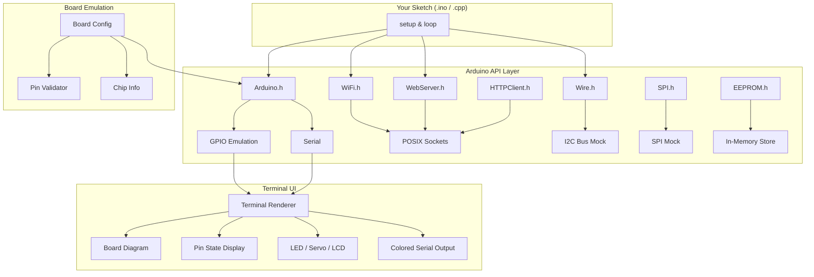

<p align="center">
  <h1 align="center">esp32emu</h1>
  <p align="center">
    <strong>Lightweight ESP32/Arduino emulator for host-side testing — real network sockets, no hardware needed.</strong>
  </p>
  <p align="center">
    <a href="https://github.com/redbasecap-buiss/esp32emu/actions/workflows/ci.yml"></a>
    <a href="LICENSE"></a>
    <a href="#"></a>
    <a href="#"></a>
    <a href="#-supported-boards"></a>
    <a href="#-examples"></a>
  </p>
</p>

---

Run your ESP32 and Arduino sketches on macOS or Linux. The HTTP server listens on localhost with real POSIX sockets — test with `curl`, your browser, or integration tests. No QEMU, no Wokwi, no hardware.

```
┌──────────────────────────────────────────────────────────────┐
│  $ ./esp32emu run examples/blink/blink.ino                   │
│                                                              │
│  ╔══════════════════════════════════╗                         │
│  ║         ESP32 DevKit            ║                         │
│  ║         ESP32 @ 240MHz          ║                         │
│  ╚══════════════════════════════════╝                         │
│                                                              │
│  💡 LED (pin 2): ON  ████                                    │
│  [INFO] Blink cycle 1                                        │
│  💡 LED (pin 2): OFF ░░░░                                    │
└──────────────────────────────────────────────────────────────┘
```

## ✨ Features

- 🔌 **Real TCP/HTTP sockets** — WebServer, WiFiClient, HTTPClient use actual POSIX sockets
- 🎯 **GPIO, I2C, SPI, EEPROM** — Full emulation with state tracking
- 📡 **WiFi simulation** — STA/AP mode, connection lifecycle, scan results
- 🖥️ **Rich Terminal UI** — Colored output, pin visualization, ASCII board diagrams
- 🎛️ **Servo, LCD, NeoPixel** — Visual mock output in terminal
- 🏗️ **Multi-board support** — ESP32, ESP32-S3, ESP32-C3, ESP32-S2, ESP32-C5, ESP32-C6, ESP32-C2, ESP32-H2, ESP32-P4, Arduino Uno, Mega, Nano, RP2040 Pico, Teensy 4.0, STM32 Blue Pill
- ⚡ **FreeRTOS tasks** — xTaskCreate, mutexes, semaphores backed by std::thread
- 💾 **SD card & filesystem** — SD, SPIFFS, LittleFS backed by host filesystem
- 😴 **Deep sleep mock** — Test power management without exiting
- 📡 **ESP-NOW** — Peer-to-peer communication mock with test helpers
- 📬 **WiFiUDP** — Real UDP sockets on loopback for NTP, DNS, etc.
- 👆 **Touch pins** — ESP32 capacitive touch with `touchRead()`, interrupt support, test helpers
- 🎵 **I2S audio** — Full I2S driver mock with TX/RX, configurable sample rate, test injection
- 🔧 **Stepper motor** — Position tracking, angle calculation, 2/4-wire support
- 📡 **IRremote** — Infrared send/receive with NEC, Sony, Samsung, RC5 protocols
- 🌡️ **BMP280 sensor** — Temperature, pressure, altitude with barometric formula
- 🌡️ **DHT sensor** — DHT11/DHT22 temperature, humidity, heat index
- 🖥️ **SSD1306 OLED** — 128x64/32 display with pixel buffer, text, shapes
- 🎮 **MPU6050 IMU** — 6-axis accelerometer/gyroscope, pitch/roll, G-force
- 🚗 **TWAI/CAN bus** — ESP32 CAN controller mock with TX/RX, filters, test helpers
- 🏭 **ModbusMaster** — Modbus RTU master mock with register/coil read/write, pre/post TX callbacks
- 🌐 **painlessMesh** — ESP-MESH networking mock with broadcast, single send, connection events
- 🎭 **ESP-DMX** — DMX-512 lighting control mock with channel read/write, packet send/receive
- 💡 **FastLED** — WS2812B/APA102 LED strip mock with CRGB, HSV, fill_rainbow
- 📋 **ArduinoJson** — JSON serialize/deserialize with nested objects, arrays, parser
- 📝 **ESP-IDF logging** — `ESP_LOGE`/`W`/`I`/`D`/`V` macros with colored output, level filtering, test hooks
- ⏱️ **ESP-IDF timers** — `esp_timer` high-resolution periodic/one-shot timers, microsecond precision
- 🎛️ **LEDC PWM** — 16-channel PWM controller with frequency/duty tracking, tone/note generation
- 📡 **BLE (Bluetooth Low Energy)** — BLEDevice, BLEServer, BLEService, BLECharacteristic, advertising, notifications, test helpers
- 📻 **RMT peripheral** — Remote Control Transceiver TX/RX, configurable channels, WS2812B-compatible timing
- 📮 **FreeRTOS Queues** — xQueueCreate, Send, Receive, Peek, SendToFront, ISR variants, cross-thread producer/consumer
- 🔌 **ESP-IDF I2C driver** — i2c_param_config, i2c_master_cmd_begin, read/write commands, test slave registration
- ⏲️ **ESP-IDF Timer driver** — Hardware timer groups, counter read, alarm, pause/resume, ISR registration
- 🔄 **PCNT (Pulse Counter)** — Rotary encoder support, configurable count modes, limits, filters, event thresholds
- 🌐 **ESP-IDF HTTP server** — `esp_http_server` mock with URI handlers, query parsing, request/response, test dispatch
- 🌐 **ESP-IDF HTTP client** — `esp_http_client` mock with GET/POST/PUT, headers, event handler, response injection
- ⚙️ **MCPWM driver** — Motor Control PWM with dual operators, frequency/duty control, start/stop, multi-unit support
- 📊 **Sigma-Delta modulation** — 8-channel sigma-delta driver with duty/prescale/GPIO configuration
- 🔀 **FreeRTOS Event Groups** — xEventGroupCreate, SetBits, WaitBits, ClearBits, Sync, cross-thread synchronization
- 📡 **ESP-IDF WiFi driver** — esp_wifi_init/start/stop/connect/scan, STA/AP config, test helpers
- 🌐 **ESP-IDF Network Interface** — esp_netif_init, create_default_wifi_sta/ap, IP info, test helpers
- ⏲️ **FreeRTOS Software Timers** — xTimerCreate, Start, Stop, Reset, ChangePeriod, Delete, one-shot and auto-reload
- 🔔 **FreeRTOS Task Notifications** — xTaskNotify, xTaskNotifyGive, ulTaskNotifyTake, xTaskNotifyWait, lightweight IPC
- 🔧 **ESP-IDF System API** — esp_restart, chip info, heap size, reset reason, random, IDF version
- 📦 **Partition Table** — esp_partition find/read/write/erase with default partition layout
- 🔄 **OTA Updates** — esp_ota begin/write/end, boot partition management, app description
- 🎵 **ESP-IDF I2S Driver** — Legacy I2S API with install/uninstall, TX/RX, pin config, sample rate
- 🔘 **OneButton** — Click, double-click, long press, multi-click with debouncing
- 🚌 **MCP2515 CAN Bus** — SPI-based CAN controller with TX/RX, loopback, filters, error counters
- 🕐 **DS3231 RTC** — Real-time clock with alarms, temperature, lost power detection
- 🎛️ **AceButton** — Event-driven button handling with configurable features, multi-button support
- ⏱️ **TaskScheduler** — Cooperative multitasking with intervals, iterations, enable/disable callbacks
- 💡 **VEML7700 Light Sensor** — Ambient light (lux), ALS, white channel, gain/integration time, power save
- ☀️ **VEML6075 UV Sensor** — UVA, UVB, UV Index, integration time, high dynamic mode
- 🌡️ **MAX31865 RTD Sensor** — PT100/PT1000 temperature, fault detection, 2/3/4-wire, bias control
- 🌡️ **SI7021 Temp & Humidity** — Temperature, humidity, heater control, resolution settings
- 🔌 **MCP4725 DAC** — 12-bit DAC output, EEPROM save, voltage float helpers, power-down modes
- 🧭 **BNO055 9-DOF IMU** — Absolute orientation, Euler angles, quaternion, accel/gyro/mag, calibration
- 🌡️ **SHTC3 sensor** — Compact humidity/temperature with sleep/wake, °C/°F, raw data access
- 🎵 **I2S v5 Standard Mode** — New ESP-IDF v5 channel API with TX/RX, write/read, enable/disable
- 🎶 **DAC Cosine Generator** — Hardware cosine waveform output with frequency, attenuation, phase control
- 🔧 **ESP32Servo** — Servo motor control with attach/detach, angle/microsecond write, custom pulse range
- ❤️ **MAX30105 Pulse Oximeter** — IR/Red/Green LED readings, temperature, beat detection, SpO2 helpers
- 📊 **ADS1015 12-bit ADC** — 4-channel single-ended/differential, programmable gain, voltage computation
- 🏋️ **BMI270 6-axis IMU** — Accelerometer/gyroscope, step counter, I2C/SPI init, configurable ODR/range
- 🔒 **mbedTLS SSL** — SSL context/config, handshake, read/write, ciphersuite query, client/server mock
- 🧵 **esp_pthread** — Thread configuration: stack size, priority, core pinning
- 🔧 **TMC2209** — Trinamic UART stepper driver with StealthChop, CoolStep, StallGuard, velocity control
- 🌡️ **AMG88xx Thermal Camera** — 8x8 IR thermal sensor array, pixel read, interrupt, power modes
- 🎛️ **PID Controller** — PID_v1 library with auto/manual mode, output limits, sample time, P_ON_M/P_ON_E
- 💨 **MQ135 Gas Sensor** — Air quality sensor with PPM, temperature/humidity correction, RZero calibration
- 🌡️ **Internal Temperature Sensor** — ESP-IDF temperature_sensor driver with install/enable/read
- 🖥️ **ESP Console** — ESP-IDF console component with command registration, parsing, dispatch
- 📋 **cJSON** — ESP-IDF native JSON library: create, parse, print, iterate, modify objects and arrays
- 🧠 **Heap Caps** — `heap_caps_malloc/free/realloc`, free size queries, PSRAM/DMA/internal caps, `multi_heap_info_t`
- 🔐 **mbedTLS** — SHA-256 hash (one-shot + streaming), HMAC, Base64 encode/decode for crypto workflows
- 📺 **ILI9341 TFT Display** — 240x320 SPI display mock with pixels, shapes, text, rotation, framebuffer readback
- 🌡️ **MAX6675 Thermocouple** — K-type thermocouple sensor, Celsius/Fahrenheit, test injection
- 📦 **FreeRTOS Stream Buffers** — xStreamBufferCreate, Send, Receive, ISR variants, message buffers
- ⚡ **ESP-IDF Power Management** — esp_pm configure, frequency locks, light sleep control
- 🛰️ **TinyGPS++** — NMEA GGA/RMC parsing, location, speed, altitude, distance/course calculations
- 📻 **LoRa (SX1276/78)** — SPI LoRa radio mock with TX/RX, packet injection, RSSI/SNR, configuration
- 💡 **NeoPixelBus** — Alternative addressable LED library with RgbColor, HslColor, rotate/shift, blend
- 📊 **ADC Oneshot driver** — New ESP-IDF ADC API with unit/channel config, raw reads, test value injection
- 🔌 **ESP-IDF UART Driver** — UART port config, TX/RX with buffered data, multi-port, test injection
- 🔐 **ESP eFuse** — Chip revision, block read/write, key blocks, test helpers
- 📡 **SoftwareSerial** — Bit-banged serial mock with RX injection, multi-instance support
- 🌐 **WiFiManager** — Captive portal WiFi provisioning mock with parameters, callbacks, portal simulation
- 🔗 **AsyncTCP** — Async TCP client/server mock (me-no-dev compatible) with data injection, callbacks
- 🔄 **ESP HTTPS OTA** — HTTPS firmware update mock with progress tracking, begin/perform/finish API
- ⚡ **INA219 Current Sensor** — Bus voltage, shunt voltage, current, power measurement with calibration modes
- 📡 **ESP-IDF MQTT Client** — `esp_mqtt_client` with connect, publish, subscribe, QoS, event callbacks, test injection
- ⏱️ **GPTimer (v5 API)** — General purpose timer with alarm, auto-reload, count up/down, event callbacks
- 💾 **ESP-IDF SPIFFS** — `esp_vfs_spiffs` register/unregister, info, format, mount state tracking
- 🖥️ **ESP-IDF Console** — `esp_console` command registration, dispatch, argument parsing, built-in help
- 🌡️ **Temperature Sensor** — ESP32 internal temp sensor driver with install/enable/read, test injection
- 📂 **LittleFS** — LittleFS filesystem mock backed by host filesystem, same API as SPIFFS
- 🎛️ **ESP-IDF LEDC Driver** — Low-level LEDC timer/channel config, duty control, fade with time, frequency management
- ⏰ **SNTP Time Sync** — esp_sntp/sntp mock with server config, sync callbacks, host clock integration
- 🔋 **ADC Calibration** — esp_adc_cal characterize and raw-to-voltage conversion with attenuation/width support
- 👆 **Touch Pad Driver** — ESP-IDF `driver/touch_pad.h` with FSM modes, thresholds, ISR, filtering, test injection
- 🔒 **ESP-TLS** — `esp_tls` connection mock for TLS client operations, global CA store
- 🔐 **HTTPS Server** — `esp_https_server` wrapper with SSL config, delegates to HTTP mock
- 🎲 **Hardware RNG** — `esp_random` / `esp_fill_random` backed by host PRNG
- 🏷️ **MAC Address** — `esp_mac` base/interface MAC read, local MAC derivation
- 🌐 **WebSocket Client** — `esp_websocket_client` with connect, send text/binary, events, receive injection, test helpers
- 🧩 **SoC Headers** — `soc/soc.h`, `soc/gpio_num.h`, `soc/rtc.h`, `soc/timer_group_struct.h` stubs for compatibility
- 🌫️ **BME680 Gas Sensor** — Temperature, humidity, pressure, gas resistance (air quality), altitude, oversampling, IIR filter
- 🌡️ **SHT31 Sensor** — Temperature/humidity with heater control, status register, dual readout
- 📬 **AsyncMqttClient** — Async MQTT client mock with connect, pub/sub, QoS, message injection, callbacks
- 🔐 **CRT Bundle** — `esp_crt_bundle_attach` stub for HTTPS certificate bundle compatibility
- 📏 **Adafruit Unified Sensor** — Abstract sensor interface (`Adafruit_Sensor`), `sensors_event_t`, `sensor_t`, used by BME280/BME680/etc.
- 🔌 **MCP23017 GPIO Expander** — 16-bit I2C GPIO expander, port A/B, pull-ups, interrupts, polarity inversion
- 📊 **ADS1115 ADC** — 16-bit 4-channel I2C ADC, single-ended/differential, programmable gain, voltage computation
- 🌡️ **BME280 Sensor** — Temperature, humidity, pressure, altitude with configurable sampling modes
- 🌡️ **AHT10/AHT20 Sensor** — Temperature & humidity sensor mock with error detection
- 🎛️ **PCA9685 PWM Driver** — 16-channel I2C PWM servo driver with frequency, sleep, microsecond control
- 📂 **ESP-IDF VFS** — Virtual File System registration/unregistration mock with path prefixes
- 📏 **VL53L0X ToF Sensor** — Time-of-Flight distance measurement, continuous mode, timing budget, signal quality
- ⚖️ **HX711 Load Cell** — Load cell amplifier with tare, scale factor, power management, weight calculation
- 🌡️ **MAX31855 Thermocouple** — K-type thermocouple with internal temp, fault detection (open/short)
- 🎨 **Adafruit_GFX** — Base graphics library with canvas, primitives, text, rotation, color565
- 🖥️ **TFT_eSPI** — TFT display library with sprites, drawing primitives, text datum, color definitions
- 🔄 **Encoder** — Rotary encoder library mock with position read/write, delta rotation
- ⚙️ **AccelStepper** — Acceleration-based stepper motor control with speed, position, run-to-target
- 🖼️ **U8g2** — Universal graphics library for OLEDs/LCDs with text, shapes, XBM, page/buffer modes
- 🖥️ **ESP-IDF LCD Driver** — `esp_lcd` panel API for ST7789, SSD1306 with SPI/I2C IO, bitmap draw, mirror/swap
- 🔋 **RTC IO Driver** — RTC GPIO init, direction, level, pull-up/down, hold for deep sleep wakeup
- 🔐 **mbedTLS AES** — AES-128/192/256 ECB/CBC encryption/decryption mock with roundtrip support
- 🎲 **mbedTLS Entropy + CTR-DRBG** — Cryptographic RNG mock with seeding, entropy sources
- 🔌 **PCF8574 I/O Expander** — 8-bit I2C GPIO expander with pin read/write, toggle, port operations
- 🌿 **SGP30 Air Quality** — TVOC/eCO2 sensor with baseline calibration, humidity compensation, raw signals
- 💾 **ESP Flash API** — `esp_flash` read/write/erase with realistic AND-only write behavior, sector erase
- 🏷️ **MFRC522 RFID** — Card detection, UID read, MIFARE auth, block read/write, PICC type identification
- 🌡️ **MLX90614 IR Thermometer** — Contactless temperature (object + ambient), °C/°F, emissivity config
- 🌬️ **CCS811 Air Quality** — eCO2/TVOC readings, drive modes, baseline calibration, environmental compensation
- 📡 **RCSwitch 433MHz RF** — Transmit/receive codes, protocol config, switch helpers (Type A/B)
- 🧲 **AS5600 Rotary Encoder** — 12-bit angle, degrees, magnet status, AGC, cumulative position, direction
- ☀️ **Adafruit LTR390** — UV index and ambient light sensor, gain/resolution config, lux/UVI calculation
- 🎨 **Adafruit NeoMatrix** — NeoPixel matrix layouts with GFX integration, tiled matrices, pixel mapping
- 🧭 **QMC5883L Magnetometer** — 3-axis compass, heading calculation, calibration offsets, temperature readout
- ⚙️ **DRV8825 Stepper Driver** — STEP/DIR stepper control, microstepping, RPM, angle/position tracking
- 💾 **SDMMC/SDSPI Host Drivers** — ESP-IDF `sdmmc_host.h` and `sdspi_host.h` for SD card host initialization
- 👆 **MPR121 Capacitive Touch** — 12-channel touch sensor, filtered/baseline data, thresholds, individual channel control
- 📐 **LIS3DH Accelerometer** — 3-axis accelerometer, configurable range/data rate, click detection, event API
- ⚡ **INA260 Power Monitor** — Precision power measurement, voltage/current/power, averaging, conversion time, alerts
- 🌬️ **SCD30 CO2 Sensor** — CO2/temperature/humidity, measurement interval, altitude compensation, auto-calibration
- 🌡️ **BMP3XX (BMP388/390)** — High-accuracy pressure/temperature, oversampling, IIR filter, altitude calculation
- 🧪 **80+ library mocks** — Drop-in replacements for Arduino and ESP-IDF APIs
- 📦 **Zero dependencies** — Only C++ stdlib + POSIX

## 🚀 Quick Start

```bash
git clone https://github.com/redbasecap-buiss/esp32emu.git
cd esp32emu

# Run all tests
make test

# Run a sketch
./esp32emu run examples/blink/blink.ino

# Run with a specific board
./esp32emu run --board uno examples/blink/blink.ino

# Run the web server demo — then open http://127.0.0.1:8080
./esp32emu run examples/webserver_demo.cpp

# Build a sketch to a standalone binary
./esp32emu build examples/blink/blink.ino -o blink
./blink
```

## 🎯 Supported Boards

| Board | Chip | Digital Pins | Analog Pins | RAM | Flash | WiFi | Bluetooth |
|-------|------|:------------:|:-----------:|-----|-------|:----:|:---------:|
| **ESP32** (default) | ESP32 | 40 | 8 | 320 KB | 4 MB | ✅ | ✅ |
| **ESP32-S3** | ESP32-S3 | 48 | 10 | 512 KB | 8 MB | ✅ | ✅ |
| **ESP32-C3** | ESP32-C3 (RISC-V) | 22 | 6 | 400 KB | 4 MB | ✅ | ❌ |
| **ESP32-S2** | ESP32-S2 | 46 | 10 | 320 KB | 4 MB | ✅ | ❌ |
| **Arduino Uno** | ATmega328P | 14 | 6 | 2 KB | 32 KB | ❌ | ❌ |
| **Arduino Mega** | ATmega2560 | 54 | 16 | 8 KB | 256 KB | ❌ | ❌ |
| **Arduino Nano** | ATmega328P | 14 | 8 | 2 KB | 32 KB | ❌ | ❌ |
| **ESP32-C6** | ESP32-C6 | 31 | 7 | 512 KB | 4 MB | ✅ WiFi 6 | ✅ BLE 5 |
| **ESP32-H2** | ESP32-H2 (RISC-V) | 22 | 5 | 320 KB | 4 MB | ❌ | ✅ BLE 5 + Zigbee |
| **RP2040 Pico** | RP2040 | 30 | 4 | 264 KB | 2 MB | ❌ | ❌ |
| **Teensy 4.0** | IMXRT1062 | 40 | 14 | 1 MB | 2 MB | ❌ | ❌ |
| **STM32 Blue Pill** | STM32F103C8 | 37 | 10 | 20 KB | 64 KB | ❌ | ❌ |
| **ESP32-P4** | ESP32-P4 (RISC-V) | 55 | 12 | 768 KB | 16 MB | ✅ | ✅ BLE 5 |
| **ESP32-C5** | ESP32-C5 (RISC-V) | 29 | 6 | 512 KB | 4 MB | ✅ WiFi 6 | ✅ BLE 5 |

> ⚠️ **Arduino boards:** WiFi/Bluetooth calls print a warning and are ignored. Pin limits are enforced per board. `LED_BUILTIN = 13` (vs pin 2 on ESP32).

## 📁 Examples

| Example | Description | Best Board |
|---------|-------------|:----------:|
| [`blink/`](examples/blink/) | Classic LED blink with terminal visualization | Any |
| [`button_led/`](examples/button_led/) | Simulated button input → LED toggle | Uno/Mega |
| [`temperature_logger/`](examples/temperature_logger/) | Fake DHT22 sensor, colored output, CSV logging | Any |
| [`rest_api/`](examples/rest_api/) | CRUD Todo REST API on localhost:8080 | ESP32 |
| [`mqtt_client/`](examples/mqtt_client/) | Simulated MQTT publish/subscribe | ESP32 |
| [`servo_sweep/`](examples/servo_sweep/) | Servo 0–180° sweep with ASCII visualization | Uno/Mega |
| [`lcd_display/`](examples/lcd_display/) | 16×2 LCD text display simulation | Uno/Mega |
| [`i2c_scanner/`](examples/i2c_scanner/) | I2C bus scanner with mock devices | Any |
| [`wifi_scanner/`](examples/wifi_scanner/) | Fake WiFi network scanner with signal bars | ESP32 |
| [`neopixel_rainbow/`](examples/neopixel_rainbow/) | NeoPixel RGB rainbow using ANSI true-color | Any |
| [`ota_update/`](examples/ota_update/) | OTA firmware update simulation with progress bar | ESP32 |
| [`captive_portal/`](examples/captive_portal/) | WiFi config portal with web UI | ESP32 |
| [`freertos_tasks/`](examples/freertos_tasks/) | FreeRTOS multi-task with mutex synchronization | ESP32 |
| [`sd_datalogger/`](examples/sd_datalogger/) | SD card CSV data logging | Any |
| [`ultrasonic_buzzer/`](examples/ultrasonic_buzzer/) | Ultrasonic sensor + buzzer parking sensor | Uno/Mega |
| [`mqtt_sensor/`](examples/mqtt_sensor/) | MQTT temp publisher + LED control subscriber | ESP32 |
| [`bluetooth_echo/`](examples/bluetooth_echo/) | Bluetooth Serial echo server | ESP32 |
| [`udp_ntp/`](examples/udp_ntp/) | UDP NTP client with WiFiUDP | ESP32 |
| [`espnow_sender/`](examples/espnow_sender/) | ESP-NOW peer-to-peer sensor data | ESP32 |
| [`deep_sleep_timer/`](examples/deep_sleep_timer/) | Deep sleep with timer wakeup | ESP32 |
| [`webserver_demo.cpp`](examples/webserver_demo.cpp) | Full WebServer with API endpoints | ESP32 |
| [`mcpwm_motor/`](examples/mcpwm_motor/) | MCPWM DC motor control with speed/direction | ESP32 |
| [`http_client_idf/`](examples/http_client_idf/) | ESP-IDF HTTP client with event handler | ESP32 |
| [`sigmadelta_led/`](examples/sigmadelta_led/) | Sigma-delta LED dimming | ESP32 |
| [`mqtt_client.cpp`](examples/mqtt_client.cpp) | ESP-IDF MQTT pub/sub with event handler | ESP32 |
| [`gptimer.cpp`](examples/gptimer.cpp) | GPTimer v5 periodic alarm with auto-reload | ESP32 |
| [`esp_spiffs.cpp`](examples/esp_spiffs.cpp) | ESP-IDF SPIFFS mount, info, format | ESP32 |
| [`bme280_weather.cpp`](examples/bme280_weather.cpp) | BME280 weather station (temp/hum/press/alt) | ESP32 |
| [`pca9685_servo.cpp`](examples/pca9685_servo.cpp) | PCA9685 16-ch servo sweep + microseconds | ESP32 |
| [`aht20_sensor.cpp`](examples/aht20_sensor.cpp) | AHT20 temperature & humidity readings | ESP32 |
| [`vfs_register.cpp`](examples/vfs_register.cpp) | ESP-IDF VFS register/unregister custom FS | ESP32 |
| [`max6675_thermocouple.cpp`](examples/max6675_thermocouple.cpp) | MAX6675 K-type thermocouple temp reading | ESP32 |
| [`ili9341_graphics.cpp`](examples/ili9341_graphics.cpp) | ILI9341 TFT display with shapes and text | ESP32 |
| [`stream_buffer_producer.cpp`](examples/stream_buffer_producer.cpp) | FreeRTOS stream buffer producer/consumer | ESP32 |
| [`power_management.cpp`](examples/power_management.cpp) | ESP-IDF power management with freq locks | ESP32 |

> 📖 See [docs/examples.md](docs/examples.md) for detailed walkthroughs of each example.

## 🖥️ Terminal UI

The emulator renders rich visual output directly in your terminal:

### Board Diagram (shown at startup)
```
    ╔══════════════════════════════════╗
    ║         ARDUINO UNO              ║
    ║         ATmega328P               ║
    ║                                  ║
    ║  D0-D13    [■■■■■■■■■■■■■■]     ║
    ║  A0-A5     [■■■■■■]             ║
    ║  PWR  [●]  USB [═══]            ║
    ╚══════════════════════════════════╝
```

### GPIO Pin States
```
┌─── GPIO States ───┐
│ GPIO  2 [OUT] HIGH ● │
│ GPIO  4 [IN ] LOW  ○ │
│ GPIO 13 [OUT] HIGH ● │
└────────────────────┘
```

### Peripheral Visualizations
```
💡 LED (pin 13): ON  ████          🔄 Servo:  90° [░░░░░░░░░░█░░░░░░░░░░]
💡 LED (pin 13): OFF ░░░░

┌──────────────────┐                ██████████████████████████████████
│ Hello World!     │  ← LCD         ↑ NeoPixel rainbow (true-color)
│ Arduino + LCD    │
└──────────────────┘

[INFO]  Sensor reading OK        ← green
[WARN]  Battery low: 3.2V        ← yellow
[ERROR] Connection timeout       ← red
```

## 📚 Supported Arduino Libraries

| Library | Status | Notes |
|---------|:------:|-------|
| `Arduino.h` | ✅ | Core functions, GPIO, Serial, timing |
| `WiFi.h` | ✅ | STA/AP mode, connection simulation |
| `WebServer.h` | ✅ | Real HTTP server on localhost |
| `HTTPClient.h` | ✅ | Real HTTP client |
| `WiFiClient.h` | ✅ | Real TCP client |
| `WiFiClientSecure.h` | ✅ | TLS mock |
| `Wire.h` | ✅ | I2C with mock device callbacks |
| `SPI.h` | ✅ | SPI mock (echo mode) |
| `EEPROM.h` | ✅ | In-memory EEPROM |
| `Preferences.h` | ✅ | NVS-like key-value storage |
| `ESP.h` | ✅ | Chip info, restart, deep sleep |
| `ESPmDNS.h` | ✅ | mDNS mock |
| `Servo.h` | ✅ | Servo mock with terminal visualization |
| `LiquidCrystal.h` | ✅ | LCD mock with terminal display |
| `SoftwareSerial.h` | ✅ | Software serial mock |
| `Adafruit_NeoPixel.h` | ✅ | NeoPixel with terminal true-color rendering |
| `SD.h` | ✅ | SD card mock using host filesystem |
| `SPIFFS.h` / `LittleFS` | ✅ | Flash filesystem mock |
| `freertos/FreeRTOS.h` | ✅ | Tasks, mutexes, semaphores (std::thread) |
| `PubSubClient.h` | ✅ | MQTT publish/subscribe with local delivery |
| `BluetoothSerial.h` | ✅ | ESP32 BT SPP with ring buffer |
| `ArduinoOTA.h` | ✅ | OTA update lifecycle simulation |
| `WiFiUDP.h` | ✅ | Real UDP sockets on loopback |
| `esp_now.h` | ✅ | ESP-NOW peer-to-peer with test helpers |
| `esp_sleep.h` | ✅ | Deep/light sleep mock (non-exiting) |
| `esp_task_wdt.h` | ✅ | Task watchdog timer mock |
| `Ticker.h` | ✅ | Non-blocking timer callbacks |
| `OneWire.h` | ✅ | OneWire bus mock with device search |
| `DallasTemperature.h` | ✅ | DS18B20 temperature sensor mock |
| `Adafruit_BME280.h` | ✅ | BME280 temp, humidity, pressure, altitude |
| `AHTxx.h` | ✅ | AHT10/AHT20 temperature & humidity |
| `Adafruit_PWMServoDriver.h` | ✅ | PCA9685 16-channel PWM servo driver |
| `esp_vfs.h` | ✅ | Virtual File System registration mock |
| `Update.h` | ✅ | Arduino OTA Update class with progress callbacks |
| `esp_camera.h` | ✅ | ESP32-CAM camera driver mock with frame injection |
| `ETH.h` | ✅ | Ethernet interface mock (LAN8720, W5500, etc.) |

## 🔧 Use as a Library

```bash
make lib
# Link against build/libesp32emu.a, include from include/
```

```cpp
#include "Arduino.h"

void setup() {
    Serial.begin(115200);
    pinMode(LED_BUILTIN, OUTPUT);
}

void loop() {
    digitalWrite(LED_BUILTIN, HIGH);
    delay(1000);
    digitalWrite(LED_BUILTIN, LOW);
    delay(1000);
}
```

## 🏗️ Architecture



> 📖 See [docs/architecture.md](docs/architecture.md) for a deep dive into the internals.

## 🧪 Tests

```bash
make test
```

18 tests cover GPIO, WiFi, WebServer, Wire, SPI, EEPROM, Preferences, Servo, LEDC, String, Board, Time, ESP, SD, SPIFFS, NeoPixel, and tone/pulseIn modules.

## 🤝 Contributing

We welcome contributions! See [CONTRIBUTING.md](CONTRIBUTING.md) for guidelines.

**Quick version:**
1. Fork & clone
2. Create a feature branch
3. Run `make test` — all tests must pass
4. Keep headers Arduino-compatible
5. No external dependencies (C++ stdlib + POSIX only)
6. Open a PR

## ❓ FAQ

<details>
<summary><strong>Can I test real HTTP endpoints?</strong></summary>

Yes! `WebServer` binds to a real port on localhost. Use `curl`, Postman, or your browser to interact with it. `HTTPClient` and `WiFiClient` also make real TCP connections.
</details>

<details>
<summary><strong>Does it work on Windows?</strong></summary>

Not yet — the emulator relies on POSIX sockets and terminal escape codes. WSL2 should work.
</details>

<details>
<summary><strong>How accurate is the emulation?</strong></summary>

The API surface matches the real Arduino/ESP32 SDK. Timing is approximate (no cycle-accurate emulation). The goal is functional testing, not hardware simulation.
</details>

<details>
<summary><strong>Can I add custom I2C devices?</strong></summary>

Yes! Use `Wire.onRequest()` and `Wire.onReceive()` callbacks, or register mock devices programmatically.
</details>

<details>
<summary><strong>Why not use PlatformIO's native mode?</strong></summary>

PlatformIO native mode doesn't provide WiFi, WebServer, or networking. esp32emu gives you real sockets, so your HTTP endpoints actually work on localhost.
</details>

## 📋 Changelog

### v0.6.0
- 🌡️ **BME280 sensor** — temperature, humidity, pressure, altitude with sampling modes
- 🌡️ **AHT10/AHT20 sensor** — temperature & humidity mock with error detection
- 🎛️ **PCA9685 PWM driver** — 16-channel I2C servo driver with frequency, sleep, microseconds
- 📂 **ESP-IDF VFS** — Virtual File System register/unregister mock with path prefixes
- 📁 4 new examples: BME280 weather station, PCA9685 servo, AHT20 sensor, VFS registration
- 🧪 4 new tests (93 total): BME280, PCA9685, AHTxx, VFS

### v0.5.0
- 💾 **SD card library** — full mock with read/write/mkdir/remove backed by host filesystem
- 📂 **SPIFFS & LittleFS** — flash filesystem mocks
- 🌈 **Adafruit NeoPixel library** — with ColorHSV, brightness, terminal true-color rendering
- 🔊 **tone()/noTone()** — buzzer/speaker simulation with terminal output
- 📏 **pulseIn()** — simulated pulse measurement (e.g., ultrasonic sensors)
- 🔀 **shiftOut()/shiftIn()** — shift register mock
- 🔧 **Bug fix**: webserver_demo missing ESP.h include
- 📁 2 new examples: SD data logger, ultrasonic parking sensor
- 🧪 4 new tests (18 total): SD, SPIFFS, NeoPixel, tone/pulseIn

### v0.2.0
- 🏗️ Arduino Uno & Mega board support with `--board` CLI flag
- 📺 Terminal UI: board ASCII art, pin state visualization, colored serial output
- 🎛️ New library mocks: Servo.h, LiquidCrystal.h, SoftwareSerial.h
- 📁 12 new examples covering diverse use cases
- ⚠️ WiFi warnings for non-WiFi boards
- 📊 Pin validation per board

### v0.1.0
- Initial release: ESP32 emulation with real sockets
- WebServer, WiFi, Wire, SPI, EEPROM, HTTPClient support

## License

MIT — see [LICENSE](LICENSE).
