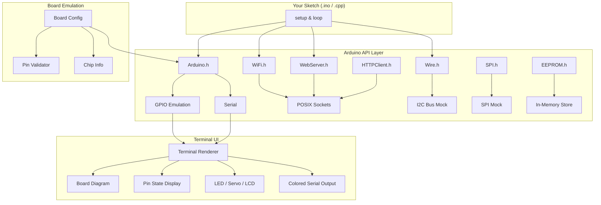

<p align="center">
  <h1 align="center">esp32emu</h1>
  <p align="center">
    <strong>Lightweight ESP32/Arduino emulator for host-side testing — real network sockets, no hardware needed.</strong>
  </p>
  <p align="center">
    <a href="https://github.com/redbasecap-buiss/esp32emu/actions/workflows/ci.yml"></a>
    <a href="LICENSE"></a>
    <a href="#"></a>
    <a href="#"></a>
    <a href="#-supported-boards"></a>
    <a href="#-examples"></a>
  </p>
</p>

---

Run your ESP32 and Arduino sketches on macOS or Linux. The HTTP server listens on localhost with real POSIX sockets — test with `curl`, your browser, or integration tests. No QEMU, no Wokwi, no hardware.

```
┌──────────────────────────────────────────────────────────────┐
│  $ ./esp32emu run examples/blink/blink.ino                   │
│                                                              │
│  ╔══════════════════════════════════╗                         │
│  ║         ESP32 DevKit            ║                         │
│  ║         ESP32 @ 240MHz          ║                         │
│  ╚══════════════════════════════════╝                         │
│                                                              │
│  💡 LED (pin 2): ON  ████                                    │
│  [INFO] Blink cycle 1                                        │
│  💡 LED (pin 2): OFF ░░░░                                    │
└──────────────────────────────────────────────────────────────┘
```

## ✨ Features

- 🔌 **Real TCP/HTTP sockets** — WebServer, WiFiClient, HTTPClient use actual POSIX sockets
- 🎯 **GPIO, I2C, SPI, EEPROM** — Full emulation with state tracking
- 📡 **WiFi simulation** — STA/AP mode, connection lifecycle, scan results
- 🖥️ **Rich Terminal UI** — Colored output, pin visualization, ASCII board diagrams
- 🎛️ **Servo, LCD, NeoPixel** — Visual mock output in terminal
- 🏗️ **Multi-board support** — ESP32, ESP32-S3, ESP32-C3, ESP32-S2, Arduino Uno, Mega, Nano
- ⚡ **FreeRTOS tasks** — xTaskCreate, mutexes, semaphores backed by std::thread
- 🧪 **16 library mocks** — Drop-in replacements for Arduino APIs
- 📦 **Zero dependencies** — Only C++ stdlib + POSIX

## 🚀 Quick Start

```bash
git clone https://github.com/redbasecap-buiss/esp32emu.git
cd esp32emu

# Run all tests
make test

# Run a sketch
./esp32emu run examples/blink/blink.ino

# Run with a specific board
./esp32emu run --board uno examples/blink/blink.ino

# Run the web server demo — then open http://127.0.0.1:8080
./esp32emu run examples/webserver_demo.cpp

# Build a sketch to a standalone binary
./esp32emu build examples/blink/blink.ino -o blink
./blink
```

## 🎯 Supported Boards

| Board | Chip | Digital Pins | Analog Pins | RAM | Flash | WiFi | Bluetooth |
|-------|------|:------------:|:-----------:|-----|-------|:----:|:---------:|
| **ESP32** (default) | ESP32 | 40 | 8 | 320 KB | 4 MB | ✅ | ✅ |
| **ESP32-S3** | ESP32-S3 | 48 | 10 | 512 KB | 8 MB | ✅ | ✅ |
| **ESP32-C3** | ESP32-C3 (RISC-V) | 22 | 6 | 400 KB | 4 MB | ✅ | ❌ |
| **ESP32-S2** | ESP32-S2 | 46 | 10 | 320 KB | 4 MB | ✅ | ❌ |
| **Arduino Uno** | ATmega328P | 14 | 6 | 2 KB | 32 KB | ❌ | ❌ |
| **Arduino Mega** | ATmega2560 | 54 | 16 | 8 KB | 256 KB | ❌ | ❌ |
| **Arduino Nano** | ATmega328P | 14 | 8 | 2 KB | 32 KB | ❌ | ❌ |

> ⚠️ **Arduino boards:** WiFi/Bluetooth calls print a warning and are ignored. Pin limits are enforced per board. `LED_BUILTIN = 13` (vs pin 2 on ESP32).

## 📁 Examples

| Example | Description | Best Board |
|---------|-------------|:----------:|
| [`blink/`](examples/blink/) | Classic LED blink with terminal visualization | Any |
| [`button_led/`](examples/button_led/) | Simulated button input → LED toggle | Uno/Mega |
| [`temperature_logger/`](examples/temperature_logger/) | Fake DHT22 sensor, colored output, CSV logging | Any |
| [`rest_api/`](examples/rest_api/) | CRUD Todo REST API on localhost:8080 | ESP32 |
| [`mqtt_client/`](examples/mqtt_client/) | Simulated MQTT publish/subscribe | ESP32 |
| [`servo_sweep/`](examples/servo_sweep/) | Servo 0–180° sweep with ASCII visualization | Uno/Mega |
| [`lcd_display/`](examples/lcd_display/) | 16×2 LCD text display simulation | Uno/Mega |
| [`i2c_scanner/`](examples/i2c_scanner/) | I2C bus scanner with mock devices | Any |
| [`wifi_scanner/`](examples/wifi_scanner/) | Fake WiFi network scanner with signal bars | ESP32 |
| [`neopixel_rainbow/`](examples/neopixel_rainbow/) | NeoPixel RGB rainbow using ANSI true-color | Any |
| [`ota_update/`](examples/ota_update/) | OTA firmware update simulation with progress bar | ESP32 |
| [`captive_portal/`](examples/captive_portal/) | WiFi config portal with web UI | ESP32 |
| [`freertos_tasks/`](examples/freertos_tasks/) | FreeRTOS multi-task with mutex synchronization | ESP32 |
| [`webserver_demo.cpp`](examples/webserver_demo.cpp) | Full WebServer with API endpoints | ESP32 |

> 📖 See [docs/examples.md](docs/examples.md) for detailed walkthroughs of each example.

## 🖥️ Terminal UI

The emulator renders rich visual output directly in your terminal:

### Board Diagram (shown at startup)
```
    ╔══════════════════════════════════╗
    ║         ARDUINO UNO              ║
    ║         ATmega328P               ║
    ║                                  ║
    ║  D0-D13    [■■■■■■■■■■■■■■]     ║
    ║  A0-A5     [■■■■■■]             ║
    ║  PWR  [●]  USB [═══]            ║
    ╚══════════════════════════════════╝
```

### GPIO Pin States
```
┌─── GPIO States ───┐
│ GPIO  2 [OUT] HIGH ● │
│ GPIO  4 [IN ] LOW  ○ │
│ GPIO 13 [OUT] HIGH ● │
└────────────────────┘
```

### Peripheral Visualizations
```
💡 LED (pin 13): ON  ████          🔄 Servo:  90° [░░░░░░░░░░█░░░░░░░░░░]
💡 LED (pin 13): OFF ░░░░

┌──────────────────┐                ██████████████████████████████████
│ Hello World!     │  ← LCD         ↑ NeoPixel rainbow (true-color)
│ Arduino + LCD    │
└──────────────────┘

[INFO]  Sensor reading OK        ← green
[WARN]  Battery low: 3.2V        ← yellow
[ERROR] Connection timeout       ← red
```

## 📚 Supported Arduino Libraries

| Library | Status | Notes |
|---------|:------:|-------|
| `Arduino.h` | ✅ | Core functions, GPIO, Serial, timing |
| `WiFi.h` | ✅ | STA/AP mode, connection simulation |
| `WebServer.h` | ✅ | Real HTTP server on localhost |
| `HTTPClient.h` | ✅ | Real HTTP client |
| `WiFiClient.h` | ✅ | Real TCP client |
| `WiFiClientSecure.h` | ✅ | TLS mock |
| `Wire.h` | ✅ | I2C with mock device callbacks |
| `SPI.h` | ✅ | SPI mock (echo mode) |
| `EEPROM.h` | ✅ | In-memory EEPROM |
| `Preferences.h` | ✅ | NVS-like key-value storage |
| `ESP.h` | ✅ | Chip info, restart, deep sleep |
| `ESPmDNS.h` | ✅ | mDNS mock |
| `Servo.h` | ✅ | Servo mock with terminal visualization |
| `LiquidCrystal.h` | ✅ | LCD mock with terminal display |
| `SoftwareSerial.h` | ✅ | Software serial mock |
| `freertos/FreeRTOS.h` | ✅ | Tasks, mutexes, semaphores (std::thread) |

## 🔧 Use as a Library

```bash
make lib
# Link against build/libesp32emu.a, include from include/
```

```cpp
#include "Arduino.h"

void setup() {
    Serial.begin(115200);
    pinMode(LED_BUILTIN, OUTPUT);
}

void loop() {
    digitalWrite(LED_BUILTIN, HIGH);
    delay(1000);
    digitalWrite(LED_BUILTIN, LOW);
    delay(1000);
}
```

## 🏗️ Architecture



> 📖 See [docs/architecture.md](docs/architecture.md) for a deep dive into the internals.

## 🧪 Tests

```bash
make test
```

Tests cover GPIO, WiFi, WebServer, Wire, SPI, EEPROM, Preferences, Servo, LEDC, String, Board, Time, and ESP modules.

## 🤝 Contributing

We welcome contributions! See [CONTRIBUTING.md](CONTRIBUTING.md) for guidelines.

**Quick version:**
1. Fork & clone
2. Create a feature branch
3. Run `make test` — all tests must pass
4. Keep headers Arduino-compatible
5. No external dependencies (C++ stdlib + POSIX only)
6. Open a PR

## ❓ FAQ

<details>
<summary><strong>Can I test real HTTP endpoints?</strong></summary>

Yes! `WebServer` binds to a real port on localhost. Use `curl`, Postman, or your browser to interact with it. `HTTPClient` and `WiFiClient` also make real TCP connections.
</details>

<details>
<summary><strong>Does it work on Windows?</strong></summary>

Not yet — the emulator relies on POSIX sockets and terminal escape codes. WSL2 should work.
</details>

<details>
<summary><strong>How accurate is the emulation?</strong></summary>

The API surface matches the real Arduino/ESP32 SDK. Timing is approximate (no cycle-accurate emulation). The goal is functional testing, not hardware simulation.
</details>

<details>
<summary><strong>Can I add custom I2C devices?</strong></summary>

Yes! Use `Wire.onRequest()` and `Wire.onReceive()` callbacks, or register mock devices programmatically.
</details>

<details>
<summary><strong>Why not use PlatformIO's native mode?</strong></summary>

PlatformIO native mode doesn't provide WiFi, WebServer, or networking. esp32emu gives you real sockets, so your HTTP endpoints actually work on localhost.
</details>

## 📋 Changelog

### v0.2.0
- 🏗️ Arduino Uno & Mega board support with `--board` CLI flag
- 📺 Terminal UI: board ASCII art, pin state visualization, colored serial output
- 🎛️ New library mocks: Servo.h, LiquidCrystal.h, SoftwareSerial.h
- 📁 12 new examples covering diverse use cases
- ⚠️ WiFi warnings for non-WiFi boards
- 📊 Pin validation per board

### v0.1.0
- Initial release: ESP32 emulation with real sockets
- WebServer, WiFi, Wire, SPI, EEPROM, HTTPClient support

## License

MIT — see [LICENSE](LICENSE).
